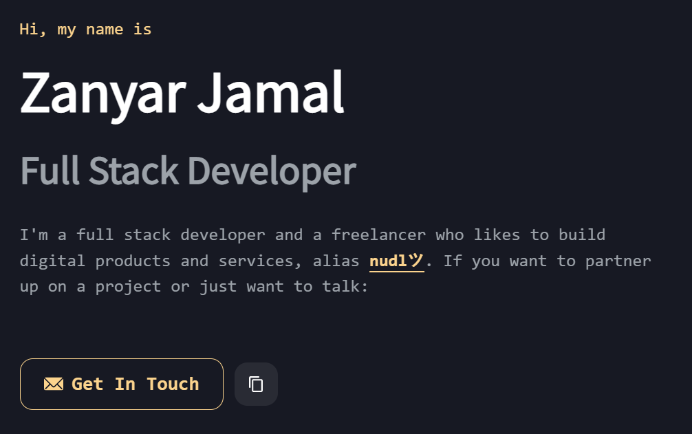

# nudlツ's portfolio
checkout the website at https://nudl.tech

     



## project structure
```bash
root/  # edit details.tsx here
│
├── out/  # exported project
│
├── public/  # replace favicon.ico and screenshot.png here
│   └── images/  # project images are stored here
└── src/
    ├── components/  # all components used in the web app
    │   └── layout/  # all layout components
    └── pages/  # you can edit index.tsx here
```

## running locally
```bash
git clone https://github.com/0xCN/nudl.tech
```
```bash
cd nudl.tech && npm install
```
```bash
npm run dev
```

## forking this repo
> this project is under MIT License. click <a href="LICENSE">here</a> to checkout it out.

you can fork this project and create your own portfolios just be sure to add a link back to <a href="https://nudl.tech">my website</a>.
